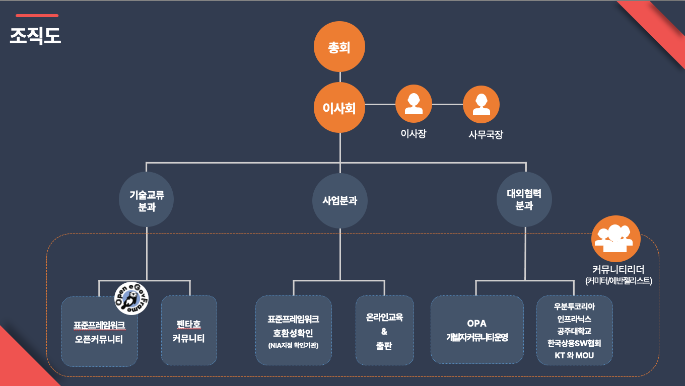

## 설립목적

(사)오픈플랫폼 개발자커뮤니티는 오픈플랫폼 및 이와 관련된 서비스의 개발 생산성과 품질을 향상시키고 관련 소프트웨어 개발자의 역량 강화와 상호 교류에 헌신하며, 오픈 소스 소프트웨어 개발과 확산을 위한 활동 지원을 통해 오픈 소스 기술참상에 기여함을 그 설립목적으로 활동을 수행 합니다

## 주요사업
- 오픈플랫폼 개발과 발전에 관한 사업
- 오픈플랫폼 관련 교육 및 국내외 확산에 관한 사업
- 오픈플랫폼 관련 소프트웨어 및 서비스 활성화에 관한 사업
- 개발자 간의 상호 교류와 유대 강화를 위한 사업
- 기타 우리 법인의 목적을 달성하기 위해 필요한 사업

## 조직도

## 법인연혁
### 2018
- <b>02</b> 제3대 송상효 이사장 취임
- <b>06</b> 오픈플랫폼 PaaS-TA Summit 2018 개최(엘타워, 300명 참석)
- <b>12</b> 전자정부 표준프레임워크 호환성확인 점검기관 지정(지정기관: 한국정보화진흥원)

### 2017~2016
- <b>02</b> (사)오픈플랫폼 개발자커뮤니티 법인설립등기
- <b>03</b> (사)오픈플랫폼 개발자커뮤니티 법인사업자등록
- <b>11</b> 제2대 전형철 이사장 취임

### 2015
- <b>04</b> 표준프레임워크 오픈커뮤니티 사단법인 설립 준비위원회 구성
- <b>05</b> (사)오픈플랫폼 개발자커뮤니티로 법인명 확정
- <b>06</b> (사)오픈플랫폼 개발자커뮤니티 창립(발기인)총회
- <b>07</b> 제1대 한상기 이사장 취임
- <b>12</b> 비영리법인 설립허가(허가기관: 과학기술정보통신부)